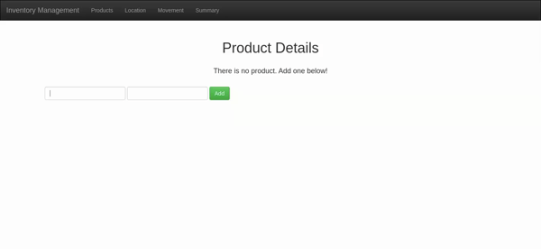
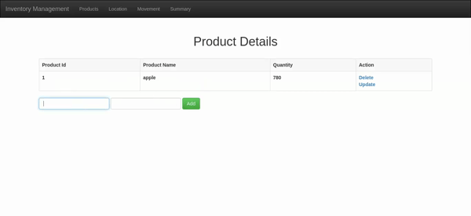
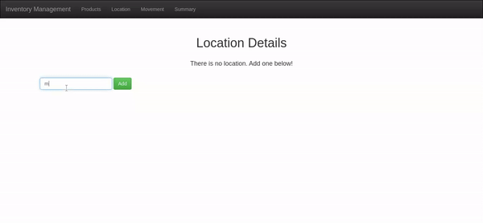
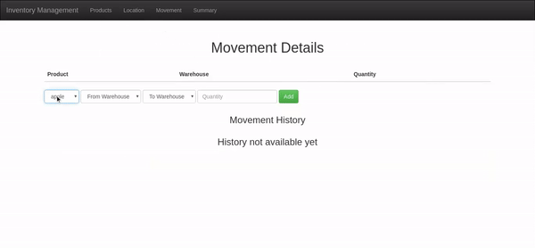
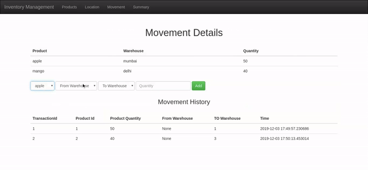
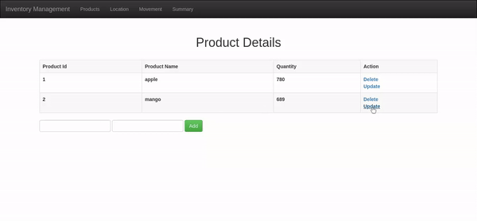
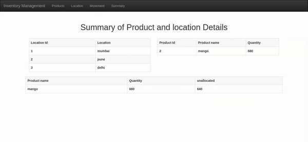

# Inventory Management System

*"Inventory Management System by using Flask"*

## Table of Contents
  - [Requirement](#Requirement)
  - [Installation](#installation)
  - [Overview](#overview)
  - [Usage](#usage)
     - [Inserting products and locations](#adding-products-and-locations)
     - [Moving things around](#moving-things-around)
     - [Editing Existing Data](#editing-existing-information)
  - [Reference](#Reference)

## Requirements

- Flask (`pip3 install flask`) is required.

## Installation

Clone the git
repository:

``` sourceCode console
$ git clone https://github.com/pooja3q/InventoryManagementSystem.git
```
You can create a virtual environment and install the required packages with the following commands:

    $ virtualenv venv
    $ . venv/bin/activate
    (venv) $ pip3 install -r requirements.txt
    
 With the virtual environment activated you can run the main script.

    (venv) $ python3 app.py
    
And the you will be navigate to http://localhost:5000 in your browser.

## Overview
The landing page covers all the product and location details along with the count of unallocated product of each type.
On Product page, Add/Edit/View operation on product can be performed .Similarly on Location page. On movement page a product can be moved from or to, to any location/warehouse, its also show the transaction of each movement along with the details of product present in locations/warhouse. 

## Usage
Initially, system will look like this




### Inserting products and locations
To add products, only the name and quantity are required



Adding locations needs only the name to be added




### Moving things around
Products can be moved into and between warehouses only after they have been added to the system

Product is being moved to warehouse.




Product is being moved from warehouse.



### Editing Existing Data

Editing Product Information




Editing Location Information




## Reference

Offical Website

- [Flask](http://flask.pocoo.org/)
- [Flask-SQLalchemy](http://flask-sqlalchemy.pocoo.org/2.1/)

Tutorial

- [Intoduction Flask](https://www.youtube.com/watch?v=Z1RJmh_OqeA/)

    
    

